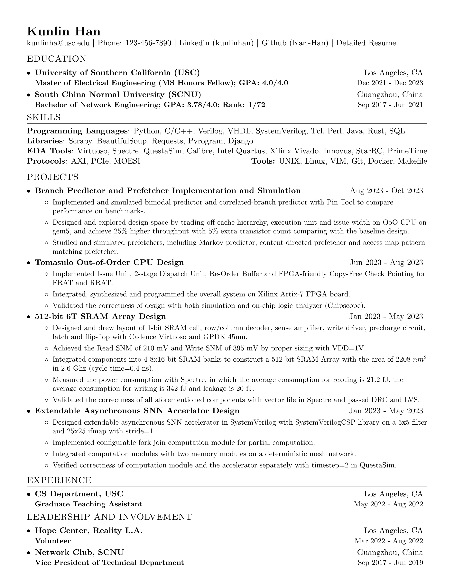

# Resume

> About me: <https://www.iwktd.com/>

New features comparing with original repository:

* Summarize user-friendly instructions in README.
* Use `master.yml` to store all information you want to include in the resume.
* Use `version_conf.yml` as template for version configration to organize the information.
    * The default build with `make` uses `config.yml` as version configuration, so `mv version_conf.yml config.yml` to get a comprehensive resume.
* Automatically generate the `config.pdf` and `config.png` with GitHub Actions.
* Add extra LaTeX commands to suit more applications.
* Comply with rules from USC recommendations in VMock.
    * Bold for job title.
    * NO italic for duration.
* Modify general information section format to avoid confusion.
    * Old template results in wrong name on myworkdayjobs.com .
    * Refer to [`old_version` branch](https://github.com/Karl-Han/resume/tree/old_template).
* Change font for clarity: <https://tex.stackexchange.com/questions/225027/how-to-create-new-font-which-is-thicker-version-of-computer-modern>

## Preview

It will be automatically generated after committing the `config.yml`.

## How to Use

There are two versions of this project:

* V1.0: `master.yml` for all information and `config.yml` for version configuration. You can freely add as many version configurations as you like without worrying about the consistency of content.
    * the release is on master branch, while the development branch will be `v1`.
    * it doesn't include any instruction related to V0.9 to avoid confusion.
* V0.9: everything is included in one file `config.yml`. Even though it is convenient to generate one resume, it is hard to generalize one master copy of resume and leads to problem of inconsistency across different version with modification.
    * checkout for this version with `git checkout v0.9` or use tag `V0.9`.

There are different ways to generate PDF:

* Install TeX command line tool and Use YAML to maintain content
    * In docker (Kind of convenient)
    * Local machine (Relative hard, but Best for Privacy)
* GitHub Actions does everything except
    * For V1.0, filling at least `master.yml` and `config.yml` for version configuration

In this README, I present the 2-commit GitHub Actions method and the others will be in [Methods](./docs/methods.md).

## GitHub Action (2-commit)

Steps:

1. Fork this repository.
2. Learn the format of YAML: [Simple Guide](https://www.cloudbees.com/blog/yaml-tutorial-everything-you-need-get-started).
3. Read the short [Practical Guide](#practical-guide) for `master.yml` to know the most-used structures.
4. Refer to [Master Format](./format.md#masteryml-master-format), study the structures by looking at `master.pdf` and `master.yml` side by side.
    * [Online Lint](https://www.yamllint.com/) if you need.
5. Commit it to the repository for your `master_version_conf.yml`.
6. ~~Then make a cup of tea.~~ Wait for the GitHub Actions to complete. Link example: <https://github.com/Karl-Han/resume/actions>
7. Get the `master_version_conf.pdf` in the repository! Your new Resume! You are all set!
8. Rename and modify the `master_version_conf.yml`, e.g., `config.yml`, by referring to [Version Configuration format](./format.md#version-configuration).
9. Modify `CONFIG_NAME`, e.g., `config`, in Makefile to change the target version configuration and commit it again.

## Practical Guide

There are hierarchies inside the YAML:

* Section (inside a global `content`): comprises
    * Items (Experience Section) with `section.layout` = `list`
    * or a few sentences below it (Skills Section) with `section.layout` = `text`
* Item (inside a section's `content`): is project or company you have worked on (CS Department, USC under Experience Section or Design and Implementation of 5-stage Pipeline Processor)
* Item Description (inside an Item's `description`): just a sentence saying what you have done or describe the Item

### Item

Refer to [available YAML format](#configyml-format), there are two practical ways to add item/project to a section with `list` as `layout`:

> You can DEFINITELY write duration in location's place! What matters most is that how many lines you want to let others know about that project/position.

* Write one with second line by filling all `title`, `location`, `sub_title` and `duration` for that item in the section. 
* Write one without second line by filling only these two, i.e., `title`, `location` for that item in the section. 

### Re-order the Sections

If you want to re-order the sections, just look at the [order keyword](#configyml-format).

You can see the example in `config.yml`.

## MISC

Other files, which may not be useful:

* Motivation for the changes to the repository: [Motivation](./docs/motivation.md)
* Further reuse, please follow me or refer to [sproogen/modern-resume-theme](https://github.com/sproogen/modern-resume-theme) website. I have [my own website](https://www.iwktd.com/) with this template.

## License

Format is MIT but all the data is owned by Kunlin Han.

## Acknowledge

Original Repository Feature:

* A single-page, one-column resume for general purpose.
* Base latex templates and fonts to provide ease of use.

This repository is originated from [sb2nov/resume](https://github.com/sb2nov/resume). Thank Sourabh Bajaj for this well organized latex template. For the original files, please refer to `original/` and the [original repository](https://github.com/sb2nov/resume).

## Appendix

### Shorthands and Concepts

* `master.yml`: the master copy of all your resume information. It should be comprehensive, because all your different versions of resume is based on it.
* Version configuration: for example `version_conf.yml` and `config.yml` is samples for versions of the resume. It should be specific for a purpose, e.g., a kind of position or a position in specific company.

### Extra LaTeX Command

* `\resumeSubheadingNoTitle`: only takes the first line of subheading without job title and duration.
    * 
* `\resumeItemOne`: only takes the description instead of skill + description, unlike the original repository.
